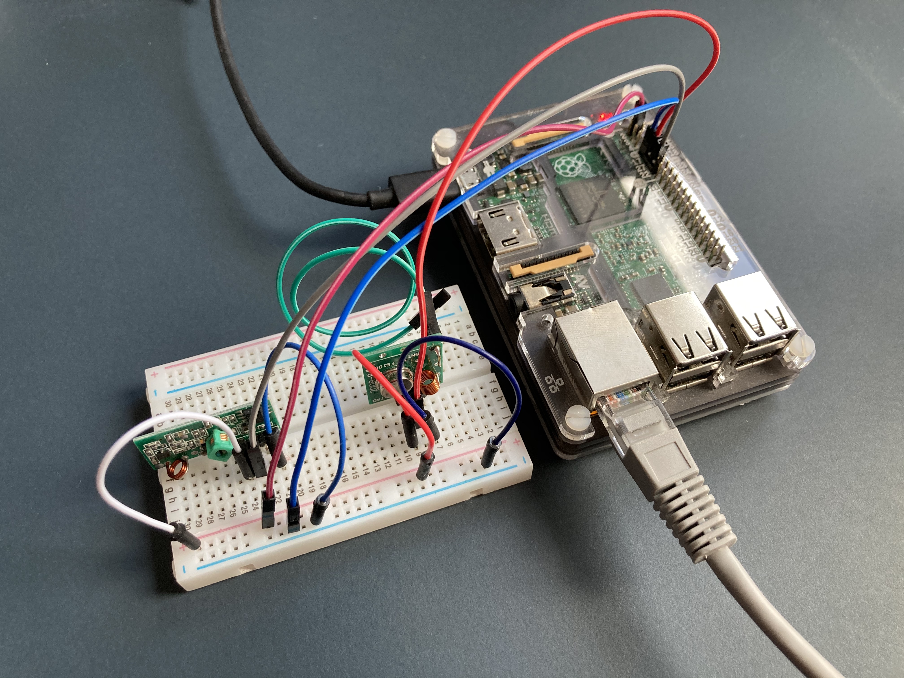
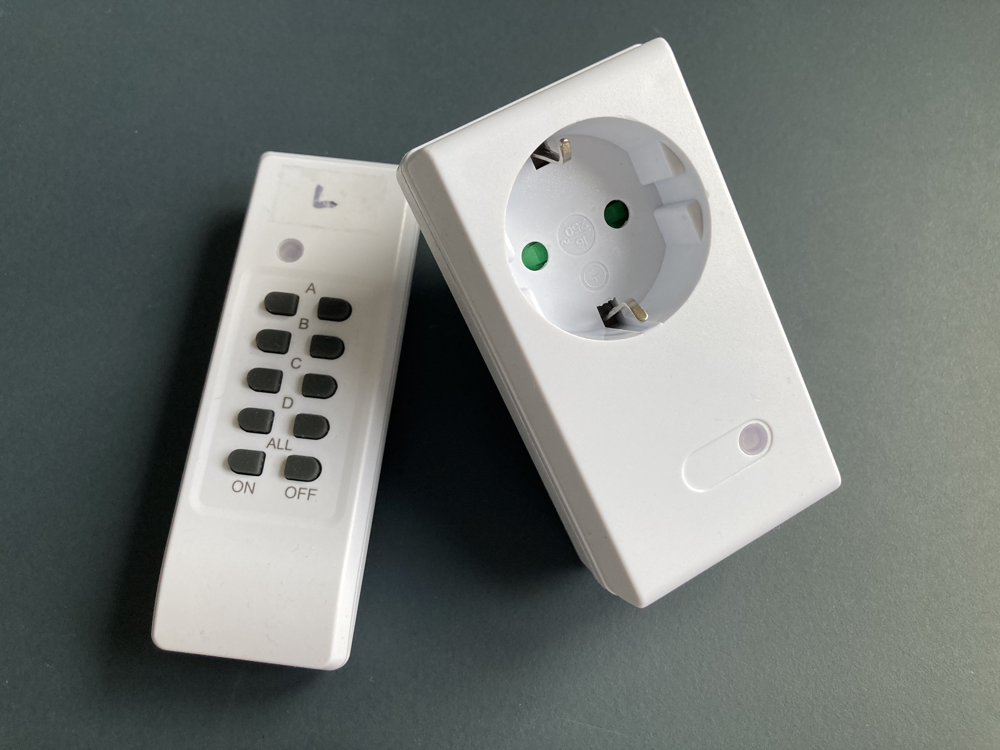

# socket-bridge

This bridge server offers a simple HTTP interface for switching on and off switchable sockets on preset channels via 433 Mhz. It can be used in combination with the *SwitchableWrapper* class (located at `/marvis/cohydra/node/switchable.py`) in order to include physically powering nodes on and off into workflows.

## Getting started

1. Clone (this part of the) repository on device with 433 Mhz transmitter (e.g., Raspberry Pi)
2. Run `make` to build dependencies: `transmit` and rc-switch
3. Run `python3 socket-bridge.py` to start the server on default port 8080
4. Send PUT to `hostname:port/socket/{1-16}/{on|off}` to switch a channel between 1 and 16 on or off

> :point_up: **Example**: `http://raspberrypi.local:8080/socket/1/on` tells a bridge server running at `http://raspberrypi.local:8080` to switch sockets on channel 1 on.

## Configure dynamically sunchronized switchable sockets (such as Mumbi RCS-20GS)

After preparing the tools, send PUT to `hostname:port/socket/{1-16}/on` with the desired channel while physically connecting the power to the socket to instruct it to listen on the respective channel.

> :point_up: **Example**: `http://raspberrypi.local:8080/socket/1/on` synchronizes the recently plugged-in socket to listen to channel 1.

## Hardware examples

## References

This work is inspired by and based on

- [sui77/rc-switch](https://github.com/sui77/rc-switch)
- [atsage/rc-switch](https://github.com/atsage/rc-switch)
- [ninjablocks/433Utils](https://github.com/ninjablocks/433Utils)

Further interesting and related projects

- [jccprj/RemoteSwitch-arduino-library](https://github.com/jccprj/RemoteSwitch-arduino-library)
- [mschlenstedt/LoxBerry-Plugin-RCSwitch](https://github.com/mschlenstedt/LoxBerry-Plugin-RCSwitch)
- [sui77/SimpleRcScanner](https://github.com/sui77/SimpleRcScanner)
